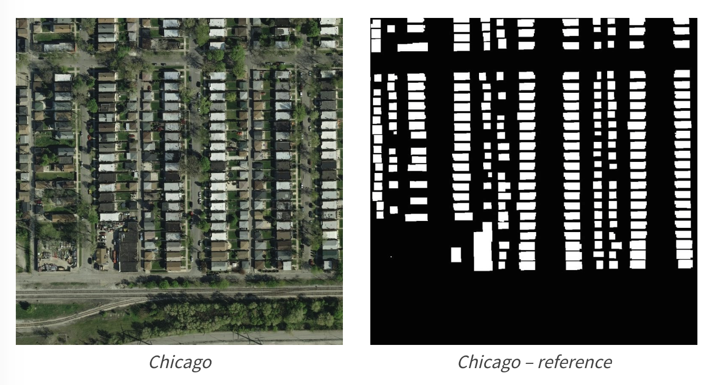

# 零基础入门语义分割-地表建筑物识别

## 赛题背景

本次新人赛是Datawhale与天池联合发起的[零基础入门系列赛事 —— 零基础入门语义分割之地表建筑物识别](https://tianchi.aliyun.com/competition/entrance/531872/introduction)。

赛题以计算机视觉为背景，要求选手使用给定的航拍图像训练模型并完成地表建筑物识别任务。为更好的引导大家入门，我们为本赛题定制了学习方案和学习任务，具体包括语义分割的模型和具体的应用案例。在具体任务中我们将讲解具体工具和使用和完成任务的过程。

通过对本方案的完整学习，可以帮助掌握语义分割基本技能。同时我们也将提供专属的视频直播学习通道。

## 任务安排

### Task1：赛题理解与baseline（3天）

- 学习主题：理解赛题内容解题流程
- 学习内容：赛题理解、数据读取、比赛baseline构建
- 学习成果：比赛baseline提交

### Task2：数据扩增方法（3天）

- 学习主题：语义分割任务中数据扩增方法
- 学习内容：掌握语义分割任务中数据扩增方法的细节和使用
- 学习成果：数据扩增方法的实践

### Task3：网络模型结构发展（3天）

- 学习主题：掌握语义分割模型的发展脉络
- 学习内容：FCN、Unet、DeepLab、SegNet、PSPNet
- 学习成果：多种网络模型的搭建

### Task4：评价函数与损失函数（3天）

- 学习主题：语义分割模型各种评价函数与损失函数
- 学习内容：Dice、IoU、BCE、Focal Loss、Lovász-Softmax 
- 学习成果：评价/损失函数的实践

### Task5：模型训练与验证（3天）

- 学习主题：数据划分方法
- 学习内容：三种数据划分方法、模型调参过程
- 学习成果：数据划分具体操作

### Task6：分割模型模型集成（3天）

- 学习主题：语义分割模型集成方法
- 学习内容：LookaHead、SnapShot、SWA、TTA
- 学习成果：模型集成思路

## 赛制说明

本次赛事分为两个阶段，分别为**正式赛**及**长期赛**。

### 正式赛

正式赛赛制选手报名成功后，选手下载数据，可以本地或天池PAI平台完成模型训练，并在测试集上进行提交。

### 长期赛

在正式赛后，本场比赛将长期开放，报名和参赛无时间限制。每天每位参赛选手可提交3次完成初赛打分；排行榜每小时更新，按照评测指标得分从高到低排序；排行榜将选择历史最优成绩进行展示；

## 赛题数据

### 数据说明

赛题数据来源（Inria Aerial Image Labeling），并进行拆分处理。数据集报名后可见并可下载。赛题数据为航拍图，需要参赛选手识别图片中的地表建筑具体像素位置。

### 评价函数

赛题使用Dice coefficient来衡量选手结果与真实标签的差异性，Dice coefficient可以按像素差异性来比较结果的差异性。Dice coefficient的具体计算方式如下：

$$
\frac{2 * |X \cap Y|}{|X| + |Y|} 
$$

其中$X$是预测结果，$Y$为真实标签的结果。当$X$与$Y$完全相同时Dice coefficient为1，排行榜使用所有测试集图片的平均Dice coefficient来衡量，分数值越大越好。

## 关注我们

