# 零基础入门语义分割-Task3 语义分割模型发展

本章主要讲解的是语义分割网络模型的发展：FCN 、SegNet、Unet、DeepLab、RefineNet、PSPNet、GAN语义分割。

## 3 语义分割模型发展

语义分割（全像素语义分割）作为经典的计算机视觉任务（图像分类，物体识别检测，语义分割）。其结合了图像分类、目标检测和图像分割，通过一定的方法将图像分割成具有一定语义含义的区域块，并识别出每个区域块的语义类别，实现从底层到高层的语义推理过程，最终得到一幅具有逐像素语义标注的分割图像。

### 3.1 学习目标
- 掌握语义分割模型的原理和训练过程；
- 掌握语义分割模型的发展脉络；
- 掌握语义分割模型的使用；

### 3.2 FCN

#### FCN原理及网络结构

FCN首先将一幅RGB图像输入到卷积神经网络后，经过多次卷积以及池化过程得到一系列的特征图，然后利用反卷积层对最后一个卷积层得到的特征图进行上采样，使得上采样后特征图与原图像的大小一样，从而实现对特征图上的每个像素值进行预测的同时保留其在原图像中的空间位置信息，最后对上采样特征图进行逐像素分类，逐个像素计算softmax分类损失。

主要特点：

- 不含全连接层（FC）的全卷积（Fully Conv）网络。从而可适应任意尺寸输入。

- 引入增大数据尺寸的反卷积（Deconv）层。能够输出精细的结果。

- 结合不同深度层结果的跳级（skip）结构。同时确保鲁棒性和精确性。

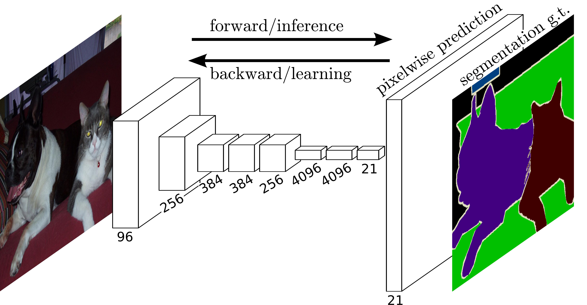 


网络结构详解图：输入可为任意尺寸图像彩色图像；输出与输入尺寸相同，深度为20类目标+背景=21，这里的类别与数据集类别保持一致。

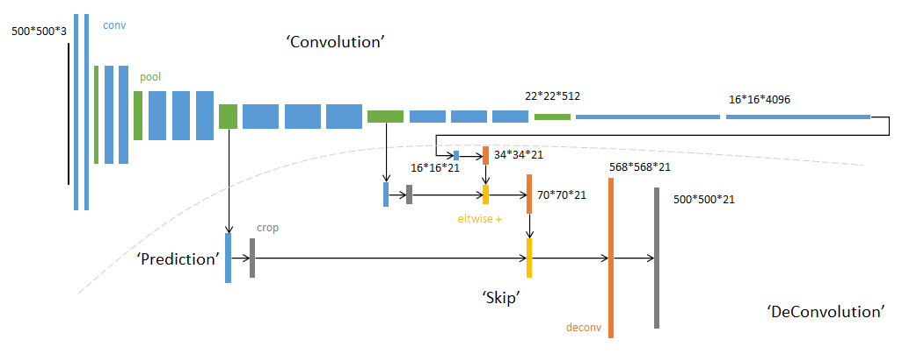 

 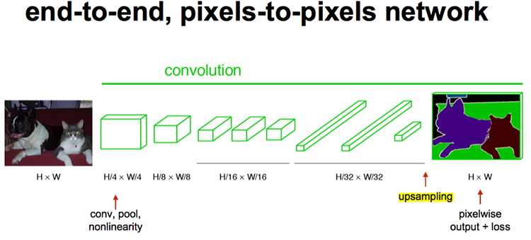 

####  反卷积（Deconvolutional）

unsamplingd的操作可以看成是反卷积（Deconvolutional）,卷积运算的参数和CNN的参数一样是在训练FCN模型的过程中通过bp算法学习得到。

普通的池化会缩小图片的尺寸，比如VGG16经过5次池化后图片被缩小了32倍。为了得到和原图等大小的分割图，我们需要上采样、反卷积。

反卷积和卷积类似，都是相乘相加的运算。只不过后者是多对一，前者是一对多。而反卷积的前向和反向传播，只用颠倒卷积的前后向传播即可。如下图所示：

 
 

####  跳跃结构

经过全卷积后的结果进行反卷积，基本上就能实现语义分割了，但是得到的结果通常是比较粗糙的。

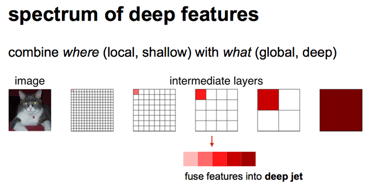


如上图所示，对原图像进行卷积conv1、pool1后原图像缩小为1/2；之后对图像进行第二次conv2、pool2后图像缩小为1/4；接着继续对图像进行第三次卷积操作conv3、pool3缩小为原图像的1/8，**此时保留pool3的featureMap**；接着继续对图像进行第四次卷积操作conv4、pool4，缩小为原图像的1/16，**保留pool4的featureMap**；最后对图像进行第五次卷积操作conv5、pool5，缩小为原图像的1/32，然后把原来CNN操作中的全连接变成卷积操作conv6、conv7，图像的featureMap数量改变但是图像大小依然为原图的1/32，**此时图像不再叫featureMap而是叫heatMap**。

现在我们有1/32尺寸的heatMap，1/16尺寸的featureMap和1/8尺寸的featureMap，1/32尺寸的heatMap进行upsampling操作之后，因为这样的操作还原的图片仅仅是conv5中的卷积核中的特征，限于精度问题不能够很好地还原图像当中的特征。因此在这里向前迭代，把conv4中的卷积核对上一次upsampling之后的图进行反卷积补充细节（相当于一个插值过程），最后把conv3中的卷积核对刚才upsampling之后的图像进行再次反卷积补充细节，最后就完成了整个图像的还原。

具体来说，就是将不同池化层的结果进行上采样，然后结合这些结果来优化输出，分为FCN-32s,FCN-16s,FCN-8s三种，第一行对应FCN-32s，第二行对应FCN-16s，第三行对应FCN-8s。 具体结构如下:

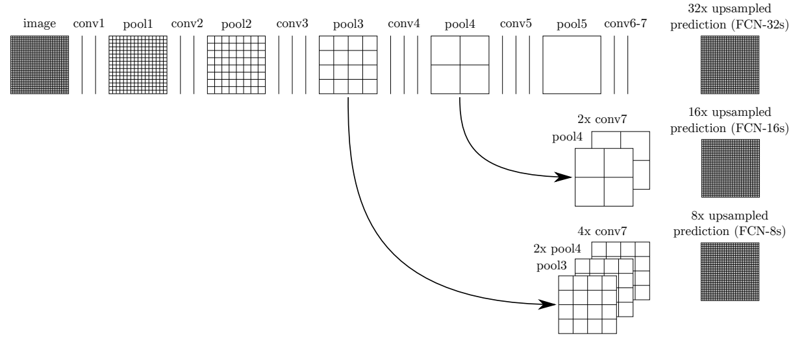 

图中，image是原图像，conv1,conv2..,conv5为卷积操作，pool1,pool2,..pool5为pool操作（pool就是使得图片变为原图的1/2），注意con6-7是最后的卷积层，最右边一列是upsample后的end to end结果。**必须说明的是图中nx是指对应的特征图上采样n倍（即变大n倍），并不是指有n个特征图，如32x upsampled 中的32x是图像只变大32倍，不是有32个上采样图像，又如2x conv7是指conv7的特征图变大2倍。**

**（1）FCN-32s过程**

只需要留意第一行，网络里面有5个pool，所以conv7的特征图是原始图像1/32，可以发现最左边image的是32x32（假设以倍数计），同时我们知道在FCN中的卷积是不会改变图像大小（或者只有少量像素的减少，特征图大小基本不会小很多）。看到pool1是16x16，pool2是8x8，pool3是4x4，pool4是2x2，pool5是1x1，所以conv7对应特征图大小为1x1，然后再经过32x upsampled prediction 图片变回32x32。FCN作者在这里增加一个卷积层，卷积后的大小为输入图像的**32**(2^5)倍，我们简单假设这个卷积核大小也为32，这样就是需要通过反馈训练32x32个权重变量即可让图像实现end to  end，完成了一个32s的upsample。FCN作者称做后卷积，他也提及可以称为反卷积。事实上在源码中卷积核的大小为64，同时没有偏置bias。还有一点就是FCN论文中最后结果都是21×*，这里的21是指FCN使用的数据集分类，总共有21类。 

**（2）FCN-16s过程**

现在我们把1,2两行一起看，忽略32x upsampled prediction，说明FCN-16s的upsample过程。FCN作者在conv7先进行一个2x conv7操作，其实这里也只是增加1个卷积层，这次卷积后特征图的大小为conv7的**2**倍，可以从pool5与2x conv7中看出来。此时2x conv7与pool4的大小是一样的，FCN作者提出对pool4与2x conv7进行一个fuse操作（**事实上就是将pool4与2x conv7相加，另一篇博客说是拼接，个人认为是拼接**）。fuse结果进行16x upsampled prediction，与FCN-32s一样，也是增加一个卷积层，卷积后的大小为输入图像的**16**(2^4)倍。我们知道pool4的大小是2x2，放大16倍，就是32x32，这样最后图像大小也变为原来的大小，至此完成了一个16s的upsample。现在我们可以知道，FCN中的upsample实际是通过增加卷积层，通过bp反馈的训练方法训练卷积层达到end to end，这时**卷积层的作用可以看作是pool的逆过程**。 

**（3）FCN-8s过程**

这是我们看第1行与第3行，忽略32x upsampled prediction。conv7经过一次4x  upsample，即使用一个卷积层，特征图输出大小为conv7的4倍，所得4x conv7的大小为4x4。然后pool4需要一次2x  upsample，变成2x pool4，大小也为4x4。再把4x conv7，2x  pool4与pool3进行fuse，得到求和后的特征图。最后增加一个卷积层，使得输出图片大小为pool3的8倍，也就是8x upsampled  prediction的过程，得到一个end to end的图像。实验表明**FCN-8s优于FCN-16s，FCN-32s**。 
我们可以发现，如果继续仿照FCN作者的步骤，我们可以对pool2，pool1实现同样的方法，可以有FCN-4s，FCN-2s，最后得到end to end的输出。这里作者给出了明确的结论，超过FCN-8s之后，结果并不能继续优化。

结合上述的FCN的全卷积与upsample，在upsample最后加上softmax，就可以对不同类别的大小概率进行估计，实现end to end。最后输出的图是一个概率估计，对应像素点的值越大，其像素为该类的结果也越大。**FCN的核心贡献在于提出使用卷积层通过学习让图片实现end to end分类。**

**事实上，FCN有一些短处**，例如使用了较浅层的特征，因为fuse操作会加上较上层的pool特征值，导致高维特征不能很好得以使用，同时也因为使用较上层的pool特征值，导致FCN对图像大小变化有所要求，如果测试集的图像远大于或小于训练集的图像，FCN的效果就会变差。

#### 训练过程

FCN训练过程分为四个阶段：

- 第1阶段

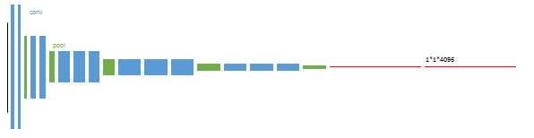

以经典的分类网络为初始化，最后两级是全连接（红色），参数舍弃不用。

- 第2阶段

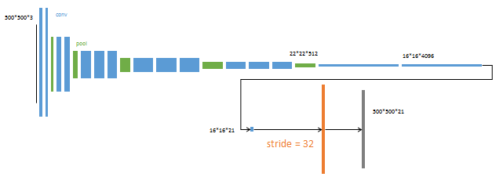


从特征图（16x16x4096）预测分割小图（ 16x16x21），之后直接升采样为大图。反卷积（橙色）的步长为32，这个网络称为FCN-32s。

- 第3阶段

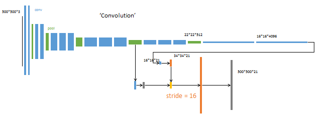

升采样分为两次完成（橙色×2）。 在第二次升采样前，把第4个pooling层（绿色）的预测结果（蓝色）融合进来。使用跳级结构提升精确性。 第二次反卷积步长为16，这个网络称为FCN-16s。 

- 第4阶段

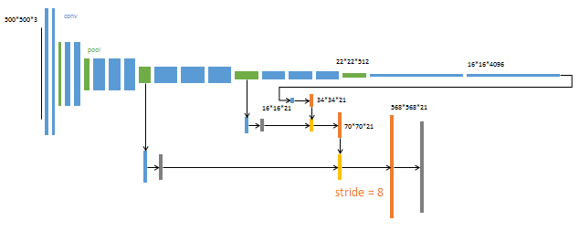

升采样分为三次完成（橙色×3）。 进一步融合了第3个pooling层的预测结果。 第三次反卷积步长为8，记为FCN-8s。 这一阶段使用单GPU训练约需1天。

较浅层的预测结果包含了更多细节信息。比较2,3,4阶段可以看出，**跳级结构利用浅层信息辅助逐步升采样**，有更精细的结果。 

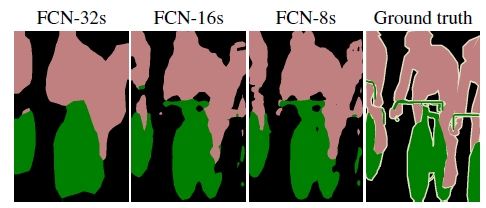 


FCN原理参考连接：

- https://blog.csdn.net/qinghuaci666/article/details/80863032
- https://openaccess.thecvf.com/content_cvpr_2015/papers/Long_Fully_Convolutional_Networks_2015_CVPR_paper.pdf


###  3.3 SegNet

Segnet是用于进行像素级别图像分割的全卷积网络，分割的核心组件是一个encoder  网络，及其相对应的decoder网络，后接一个象素级别的分类网络。

encoder网络：其结构与VGG16网络的前13层卷积层的结构相似。decoder网络：作用是将由encoder的到的低分辨率的feature maps  进行映射得到与输入图像featuremap相同的分辨率进而进行像素级别的分类。

Segnet的亮点：decoder进行上采样的方式，直接利用与之对应的encoder阶段中进行max-pooling时的polling index 进行非线性上采样，这样做的好处是上采样阶段就不需要进行学习。 上采样后得到的feature maps  是非常稀疏的，因此，需要进一步选择合适的卷积核进行卷积得到dense featuremaps 。

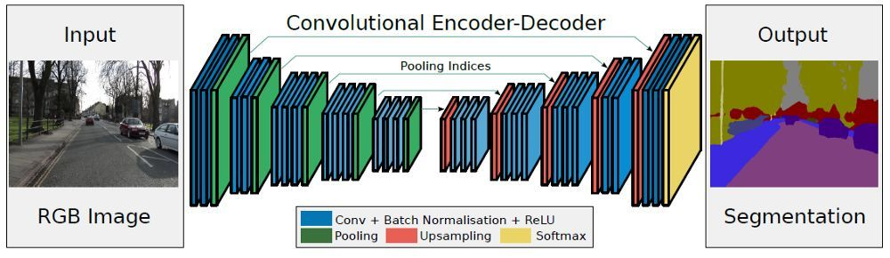 

SegNet的思路和FCN十分相似，只是Encoder，Decoder（Unsampling）使用的技术不一样。SegNet的编码器部分使用的是VGG16的前13层卷积网络，每个编码器层都对应一个解码器层，最终解码器的输出被送入soft-max分类器以独立的为每个像素产生类别概率。

左边是卷积提取特征，通过pooling增大感受野，同时图片变小，该过程称为Encoder，右边是反卷积（在这里反卷积与卷积没有区别）与unsampling，通过反卷积使得图像分类后特征得以重现，upsampling还原到原图想尺寸，该过程称为Decoder，最后通过Softmax，输出不同分类的最大值，得到最终分割图。

**Encoder编码器**

- 在编码器处，执行卷积和最大池化。
- VGG-16有13个卷积层。 （不用全连接的层）
- 在进行2×2最大池化时，存储相应的最大池化索引（位置）。

**Decoder解码器**

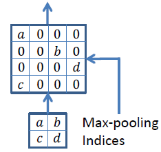 

使用最大池化的索引进行上采样

- 在解码器处，执行上采样和卷积。最后，每个像素送到softmax分类器。
- 在上采样期间，如上所示，调用相应编码器层处的最大池化索引以进行上采样。
- 最后，使用K类softmax分类器来预测每个像素的类别。

### 3.4 Unet

U-net对称语义分割模型，该网络模型主要由一个收缩路径和一个对称扩张路径组成，收缩路径用来获得上下文信息，对称扩张路径用来精确定位分割边界。U-net使用图像切块进行训练，所以训练数据量远远大于训练图像的数量，这使得网络在少量样本的情况下也能获得不变性和鲁棒性。

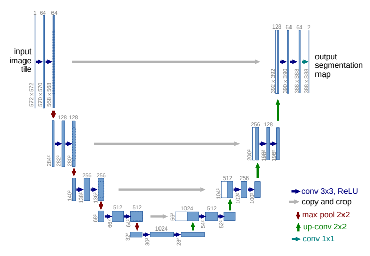

- Encoder：左半部分，由两个3x3的卷积层（RELU）+2x2的max pooling层（stride=2）反复组成，每经过一次下采样，通道数翻倍；

- Decoder：右半部分，由一个2x2的上采样卷积层（RELU）+Concatenation（crop对应的Encoder层的输出feature map然后与Decoder层的上采样结果相加）+2个3x3的卷积层（RELU）反复构成；

- 最后一层通过一个1x1卷积将通道数变成期望的类别数。

###  3.5 DeepLab

基于全卷积对称语义分割模型得到的分割结果比较粗糙，忽略了像素与像素之间的空间一致性关系。于是Google提出了一种新的扩张卷积语义分割模型，考虑了像素与像素之间的空间一致性关系，可以在不增加数量的情况下增加感受野。

- Deeplabv1是由深度卷积网路和概率图模型级联而成的语义分割模型，由于深度卷积网路在重复最大池化和下采样的过程中会丢失很多的细节信息，所以采用扩张卷积算法增加感受野以获得更多上下文信息。考虑到深度卷积网路在图像标记任务中的空间不敏感性限制了它的定位精度，采用了完全连接条件随机场（Conditional Random Field， CRF）来提高模型捕获细节的能力。
- Deeplabv2予以分割模型增加了ASPP（Atrous spatial pyramid pooling）结构，利用多个不同采样率的扩张卷积提取特征，再将特征融合以捕获不同大小的上下文信息。
- Deeplabv3语义分割模型，在ASPP中加入了全局平均池化，同时在平行扩张卷积后添加批量归一化，有效地捕获了全局语义信息。
- DeepLabV3+语义分割模型在Deeplabv3的基础上增加了编-解码模块和Xception主干网路，增加编解码模块主要是为了恢复原始的像素信息，使得分割的细节信息能够更好的保留，同时编码丰富的上下文信息。增加Xception主干网络是为了采用深度卷积进一步提高算法的精度和速度。在inception结构中，先对输入进行1*1卷积，之后将通道分组，分别使用不同的3*3卷积提取特征，最后将各组结果串联在一起作为输出。

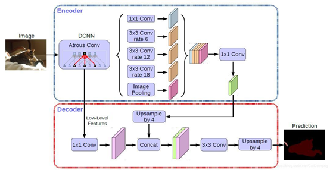 

主要特点：

- 在多尺度上为分割对象进行带洞空间金字塔池化（ASPP）
- 通过使用DCNNs（空洞卷积）提升了目标边界的定位
- 降低了由DCNN的不变性导致的定位准确率

###  3.6 RefineNet

RefineNet采用了通过细化中间激活映射并分层地将其链接到结合多尺度激活，同时防止锐度损失。网络由独立的RefineNet模块组成，每个模块对应于ResNet。

每个RefineNet模块由三个主要模块组成，即剩余卷积单元（RCU），多分辨率融合（MRF）和链剩余池（CRP）。RCU块由一个自适应块组成卷积集，微调预训练的ResNet权重对于分割问题。MRF层融合不同的激活物使用卷积上采样层来创建更高的分辨率地图。最后，在CRP层池中使用多种大小的内核用于从较大的图像区域捕获背景上下文。

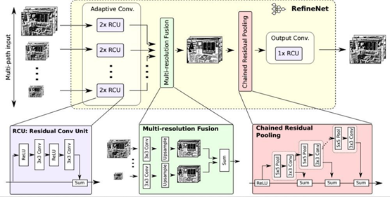 

主要特点：
- 提出一种多路径refinement网络，称为RefineNet。这种网络可以使用各个层级的features，使得语义分割更为精准。
- RefineNet中所有部分都利用resdiual connections (identity mappings)，使得梯度更容易短向或者长向前传，使端对端的训练变得更加容易和高效。 
- 提出了一种叫做chained residual pooling的模块，它可以从一个大的图像区域捕捉背景上下文信息。

### 3.7 PSPNet

深度卷积神经网络的每一层特征对语义分割都有影响，如何将高层特征的语义信息与底层识别的边界与轮廓信息结合起来是一个具有挑战性的问题。

金字塔场景稀疏网络语义分割模型（Pyramid Scene Parsing Network，PSP）首先结合预训练网络 ResNet和扩张网络来提取图像的特征，得到原图像 1/8 大小的特征图，然后，采用金字塔池化模块将特征图同时通过四个并行的池化层得到四个不同大小的输出，将四个不同大小的输出分别进行上采样，还原到原特征图大小，最后与之前的特征图进行连接后经过卷积层得到最后的预测分割图像。

- PSPNet为像素级场景解析提供了有效的全局上下文先验
- 金字塔池化模块可以收集具有层级的信息，比全局池化更有代表性
- 在计算量方面，我们的PSPNet并没有比原来的空洞卷积FCN网络有很大的增加
- 在端到端学习中，全局金字塔池化模块和局部FCN特征可以被同时训练

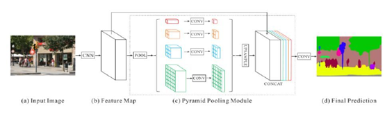

主要特点：

- 金字塔场景解析网络是建立在FCN之上的基于像素级分类网络。将大小不同的内核集中在一起激活地图的不同区域创建空间池金字塔。
- 特性映射来自网络被转换成不同分辨率的激活，并经过多尺度处理池层，稍后向上采样并与原始层连接进行分割的feature map。
- 学习的过程利用辅助分类器进一步优化了像ResNet这样的深度网络。不同类型的池模块侧重于激活的不同区域地图。


###  3.8 基于全卷积的GAN语义分割模型

生成对抗网络模型（Generative Adversarial Nets，GAN）同时训练生成器 G 和判别器 D，判别器用来预测给定样本是来自于真实数据还是来自于生成模型。

利用对抗训练方法训练语义分割模型，将传统的多类交叉熵损失与对抗网络相结合，首先对对抗网络进行预训练，然后使用对抗性损失来微调分割网络，如下图所示。左边的分割网络将 RGB 图像作为输入，并产生每个像素的类别预测。右边的对抗网络将标签图作为输入并生成类标签（1 代表真实标注，0 代表合成标签）。

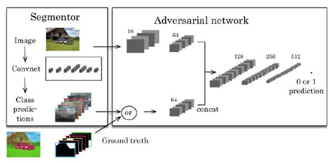

参考链接：https://cloud.tencent.com/developer/article/1589733

### 3.9 具体调用

对于常见的语义分割模型，推荐可以直接使用segmentation_models_pytorch库完成：

```
import segmentation_models_pytorch as smp

model = smp.Unet(
    encoder_name="resnet34",        # choose encoder, e.g. mobilenet_v2 or efficientnet-b7
    encoder_weights="imagenet",     # use `imagenet` pre-trained weights for encoder initialization
    in_channels=1,                  # model input channels (1 for gray-scale images, 3 for RGB, etc.)
    classes=3,                      # model output channels (number of classes in your dataset)
)
```

### 3.9 本章小结

本章对常见的语义分割网络模型进行介绍，并使用segmentation_models_pytorch完成具体调用。

### 4.11 课后作业

- 理解语义分割模型构造过程，特别是最终概率值的输出；
- 理解FCN的网络模型结构和训练过程；